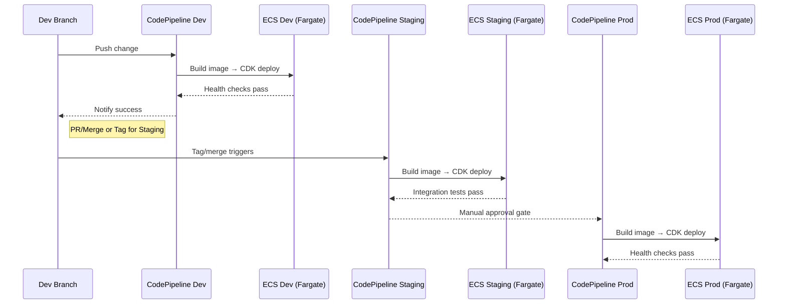

# BookStack on AWS ECS (Fargate) — Reference Deployment Pattern

This repository provides a reference pattern for deploying the BookStack application to Amazon ECS using AWS Fargate, delivered via:

- GitHub (via AWS CodeConnections) for source control
- AWS CodePipeline + CodeBuild for CI/CD
- AWS CDK v2 (TypeScript) for infrastructure as code

It is designed to support multiple environments (e.g., `dev`, `staging`, `prod`) with clear promotion flows and environment-specific configuration.


## cdk implementation (what this repo currently deploys)

The `cdk` directory contains a ready-to-deploy AWS CDK v2 implementation that provisions:

- VPC integration via lookup (deploys into an existing VPC)
- Public Application Load Balancer (ALB) with HTTPS only (HTTP → HTTPS redirect) using ACM
- Route 53 alias record for the app hostname
- ECS Fargate cluster and a BookStack service running `ghcr.io/linuxserver/bookstack`
  - ARM64 tasks by default
  - Tasks in private isolated subnets
  - Health checks on `/`
- Data layer:
  - Aurora MySQL Serverless v2 cluster with credentials in Secrets Manager
  - DB Security Group allowing MySQL from VPC only
  - BookStack app is wired to the DB endpoint and `DB_PASSWORD` via Secrets Manager
  - S3 bucket for attachments/storage (granted to task execution role)

Where to look in code (current implementation):
- `cdk/src/cdk.mts` — CDK app entrypoint
- `cdk/src/pipeline-stack.mts` — CI/CD pipeline using GitHub connection
- `cdk/src/regional-stage.mts` — deploys DataStack then App stack with wiring
- `cdk/src/data-stack.mts` — Aurora MySQL (RDS) and DB secret
- `cdk/src/app-stack.mts` — ECS Fargate service, ALB (HTTPS + redirect), Route 53, S3 permissions
- `cdk/src/globals.mts` — constants like VPC ID, domains, accounts, regions

Configuration is driven primarily by `globals.mts` and stack props rather than `cdk.json` context.
Ensure the following exist in the target account/region:
- Existing VPC ID (referenced via `Vpc.DevOregon` in `globals.mts`)
- Hosted zone (e.g., `Zone.Dev` in `globals.mts`)
- SSM Parameter Store SecureString `/app/bookstack/app_key` containing the BookStack `APP_KEY`

Important behavior and defaults:
- Image: `ghcr.io/linuxserver/bookstack:latest` (ARM64). Adjust in `app-stack.mts` if needed.
- Secrets:
  - `DB_PASSWORD` is read from Secrets Manager (created in `data-stack.mts`).
  - `APP_KEY` is read from SSM Parameter Store at `/app/bookstack/app_key` and injected as a container secret.
- Networking: tasks run in private isolated subnets; ALB is internet-facing and terminates TLS, forwarding to the service on port 80.
- TLS: HTTP (80) is open only for redirect to HTTPS (443); ACM cert is DNS-validated using the hosted zone.
- Permissions: the ECS task execution role is granted read/write to the S3 assets bucket.

Container configuration (as defined in `app-stack.mts`):
- Port: `80`
- CPU/Memory: `1024` CPU, `2048` MiB memory
- Desired count: `1`
- Env vars set:
  - `APP_LANG=en`
  - `APP_URL=https://<app domain from globals>`
  - `DB_HOST` from the Aurora cluster endpoint
  - `DB_USERNAME=bookstack`, `DB_DATABASE=bookstack`
  - `STORAGE_TYPE=s3`, `STORAGE_S3_BUCKET=<provisioned-bucket>`, `STORAGE_S3_REGION=<stack region>`
- Secrets:
  - `DB_PASSWORD` from Secrets Manager
  - `APP_KEY` from SSM Parameter Store (`/app/bookstack/app_key`)

Quick start (cdk):
1. Prereqs: Node.js 22+, AWS CLI configured, AWS CDK v2, and pnpm
2. Ensure prerequisites exist in AWS (VPC, hosted zone, and SSM parameter `/app/bookstack/app_key`)
3. Install and synthesize
   - `pnpm -r i`
   - `cd cdk && pnpm build && pnpx cdk synth`
4. Deploy pipeline or stacks
   - Pipeline (recommended): repo/branch configured in `pipeline-stack.mts`; deploy `PlatformPipelineStack`
   - Direct: `pnpx cdk deploy` appropriate stacks/stages
5. After deploy, access BookStack at `https://<app domain from globals>`

Notes and recommendations:
- Keep `APP_KEY` in SSM Parameter Store (SecureString) and restrict IAM to least privilege.
- Consider enabling access logging on the ALB and lifecycle policies on the S3 bucket.
- For production, tune Aurora capacity and enable Multi-AZ if required.


## What you get
- A recommended AWS architecture for BookStack on ECS with Fargate
- Example CI/CD flow using GitHub → CodePipeline/CodeBuild → ECS (via CDK)
- Environment strategy and promotion workflow
- Guidance on BookStack configuration (DB, storage, auth) and secret management on ECS
- Example CDK stack decomposition and suggested repo layout


## Architecture Overview

Core components per environment:
- Amazon ECS cluster on Fargate (`ecs-dev`, `ecs-staging`, `ecs-prod`)
- ECS Service (Fargate) running BookStack Task Definition
- Application Load Balancer (ALB) + HTTPS via ACM
- Amazon RDS (MariaDB or Aurora MySQL) for BookStack database
- Amazon S3 for attachments and images (optional, recommended)
- AWS Secrets Manager for DB credentials, app key, SMTP and S3 secrets
- Amazon ECR for the BookStack container image (or use upstream image)
- Amazon Route 53 for DNS
- Amazon CloudWatch Logs for task logs

Networking:
- VPC with public subnets (ALB) and private subnets (Fargate tasks, RDS)
- Security groups to restrict traffic: ALB → ECS tasks (HTTPS/HTTP), ECS tasks → RDS (3306), tasks → S3 via VPC endpoints (optional)

Scaling:
- ECS Service auto scaling on CPU/Memory or ALB RequestCount


## High-Level Flow Diagram (Change Propagation)

```mermaid
flowchart LR
  A[Developer Commit to GitHub (main)] --> B[CodePipeline - Dev]
  B --> C[CodeBuild: Build Docker & Push to ECR]
  C --> D[CDK Deploy: Update ECS Task/Service]
  D --> E[Automated/Manual Tests]
  E -->|Manual approval| F[Merge/Tag for Staging]
  F --> G[CodePipeline - Staging]
  G --> H[Build/Deploy to ECS Staging]
  H --> I[Integration/Perf Tests]
  I -->|Manual approval| J[Merge/Tag for Prod]
  J --> K[CodePipeline - Prod]
  K --> L[Build/Deploy to ECS Prod]
```


## Repository Layout (suggested)

```
bookstack-demo/
├─ cdk/                           # CDK app(s)
│  ├─ bin/                        # entrypoints per env (e.g., dev.ts, prod.ts)
│  ├─ lib/                        # stacks: vpc, ecs, rds, alb/dns, pipelines
│  └─ cdk.json
├─ app/                           # (optional) app-level config/templates
├─ docker/                        # Docker context if building a custom image
│  └─ Dockerfile                  # e.g., FROM linuxserver/bookstack
├─ env/                           # per-environment config (YAML/JSON)
│  ├─ dev/config.yaml
│  ├─ staging/config.yaml
│  └─ prod/config.yaml
├─ pipelines/                     # CodeBuild specs, pipeline definitions
│  ├─ buildspec-image.yaml        # build & push image to ECR
│  ├─ buildspec-deploy.yaml       # cdk synth & deploy (update ECS service)
│  └─ cdk-pipeline.ts             # or .py (if using CDK Pipelines)
└─ README.md
```


## CDK Stacks (suggested decomposition)

- `NetworkStack` (optional if using existing VPC)
- `EcsStack` (ECS cluster, Fargate service/task, ALB, listeners, target groups)
- `RdsStack` (Aurora MySQL or MariaDB with secrets)
- `DnsStack` (Route 53 hosted zone and records, ACM certs)
- `BookstackPipelineStack` (CodeCommit repo, CodePipeline, CodeBuild projects, IAM roles, ECR)

Dependencies: `EcsStack` references Secrets Manager values from `RdsStack` and uses ACM certs/Route 53 records from `DnsStack`. `BookstackPipelineStack` builds/pushes the image to ECR and triggers `cdk deploy` to roll the ECS service.


## BookStack Deployment Model on ECS

You can run BookStack using the official `linuxserver/bookstack` image or a custom derivative. The ECS Task Definition wires configuration using environment variables and secrets from Secrets Manager.

Key runtime configuration (env vars and secrets):
- `APP_URL` → environment-specific DNS
- `DB_HOST`, `DB_DATABASE`, `DB_USERNAME`, `DB_PASSWORD`, `DB_CONNECTION` (mysql/mariadb)
- `APP_KEY` (generate and store securely in Secrets Manager)
- `FILESYSTEM_DRIVER` (`local` or `s3`), plus `AWS_ACCESS_KEY_ID`, `AWS_SECRET_ACCESS_KEY`, `AWS_DEFAULT_REGION`, `AWS_BUCKET` if using S3
- SMTP: `MAIL_HOST`, `MAIL_PORT`, `MAIL_USERNAME`, `MAIL_PASSWORD`, `MAIL_ENCRYPTION`

Load balancing & TLS:
- ALB with HTTPS listener (443) using ACM certificate; target group health checks on `HTTP /` or `/health` if you add one.


## CI/CD Pattern

Source: GitHub repository (connected via AWS CodeConnections).

Pipelines: One pipeline per environment or a single multi-stage pipeline with approvals. Example flow:

1. Developer pushes to `main` (or configured) branch
2. CodePipeline (Dev) triggers
   - CodeBuild Image stage: Build Docker image and push to ECR
   - CodeBuild Deploy stage: `cdk synth && cdk deploy` to update ECS Task Definition/Service with new image tag
3. On approval/merge/tag, the Staging pipeline runs and deploys similarly
4. After tests and approval, Prod pipeline deploys

Example buildspecs (snippets):

Image build and push (`pipelines/buildspec-image.yaml`):

```yaml
version: 0.2
env:
  variables:
    IMAGE_REPO_NAME: bookstack
phases:
  pre_build:
    commands:
      - aws --version
      - ACCOUNT_ID=$(aws sts get-caller-identity --query Account --output text)
      - aws ecr get-login-password --region $AWS_REGION | docker login --username AWS --password-stdin $ACCOUNT_ID.dkr.ecr.$AWS_REGION.amazonaws.com
      - IMAGE_URI=$ACCOUNT_ID.dkr.ecr.$AWS_REGION.amazonaws.com/$IMAGE_REPO_NAME
      - GIT_SHA=$(echo $CODEBUILD_RESOLVED_SOURCE_VERSION | cut -c1-7)
  build:
    commands:
      - docker build -t $IMAGE_URI:$GIT_SHA -t $IMAGE_URI:latest ./docker
  post_build:
    commands:
      - docker push $IMAGE_URI:$GIT_SHA
      - docker push $IMAGE_URI:latest
      - printf '{"imageUri":"%s"}' "$IMAGE_URI:$GIT_SHA" > imageDetail.json
artifacts:
  files:
    - imageDetail.json
```

CDK deploy (`pipelines/buildspec-deploy.yaml`):

```yaml
version: 0.2
phases:
  install:
    runtime-versions:
      nodejs: 22
    commands:
      - npm i -g aws-cdk
  build:
    commands:
      - export IMAGE_URI=$(cat imageDetail.json | jq -r '.imageUri')
      - cdk synth
      - cdk deploy --require-approval never
artifacts:
  files: []
```

Notes:
- The CDK stack should read the image tag/URI (e.g., from `IMAGE_URI` env or SSM Parameter) and update the ECS Task Definition accordingly.
- Consider AWS CodeDeploy Blue/Green for ECS for zero-downtime and safer rollouts.


## Environment Configuration

Each environment directory (e.g., `env/dev/config.yaml`) may define:
- `domain`: `bookstack.dev.example.com`
- `imageRepo`: ECR repo name and tag strategy
- `cpu`, `memory`, `desiredCount`, scaling targets
- `rds` connection secrets reference (Secrets Manager ARN)
- `s3` bucket name and IAM policy attachments
- `alb` listener rules and health check path

Secrets management approaches:
- Store DB credentials in Secrets Manager and `APP_KEY` in SSM Parameter Store (SecureString). Reference them in the ECS Task Definition `secrets`.
- Use separate secrets/parameters per environment to avoid cross-env leakage.


## DNS & TLS

- Use Route 53 for DNS records like `bookstack.dev.example.com`, `bookstack.staging.example.com`, `bookstack.example.com`.
- Use ACM certificates for the domain/hosts. Attach to ALB HTTPS listener.
- HTTP (80) is configured only for HTTP→HTTPS redirection.


## Promotion Workflow Diagram (Environments)




## Getting Started (Step-by-step)

1. Bootstrap CDK in your AWS account/regions
   - `cdk bootstrap aws://ACCOUNT/REGION`
2. Deploy core infrastructure with CDK
   - VPC (if needed), RDS, ECS cluster, ALB, DNS/ACM, ECR
3. Create CodeCommit repo and push this project
4. Deploy the `BookstackPipelineStack` (CDK) to set up ECR + pipelines + CodeBuild projects
5. Configure environment files: `env/dev|staging|prod/config.yaml`
6. Store secrets in Secrets Manager (DB credentials, `APP_KEY`, SMTP, S3 keys)
7. Let the Dev pipeline run; verify BookStack at `https://bookstack.dev.example.com`
8. Promote to Staging/Prod via merge/tag and approvals


## BookStack Configuration Notes

Refer to the official docs: https://www.bookstackapp.com/docs/admin/installation/

Common env variables (set via ECS task definition env/secret):
- `APP_URL`
- `DB_HOST`, `DB_DATABASE`, `DB_USERNAME`, `DB_PASSWORD`
- `DB_CONNECTION` (mysql or mariadb)
- `APP_KEY` (application key; generate and store securely)
- `FILESYSTEM_DRIVER` (local or s3) and S3 credentials if applicable
- `MAIL_HOST`, `MAIL_PORT`, `MAIL_USERNAME`, `MAIL_PASSWORD`, `MAIL_ENCRYPTION`


## Security & Compliance

- Use distinct IAM roles: Task Execution Role (pull image, write logs) and Task Role (S3 and Secrets access with least privilege)
- Restrict security groups: ALB inbound 443 from internet; ALB → tasks on listener port; tasks → RDS 3306; no inbound to RDS from internet
- Enforce TLS in transit: ALB HTTPS; optionally RDS require SSL
- Rotate secrets via Secrets Manager and reference them directly in the task definition
- Consider AWS WAF on the ALB
- Configure CloudWatch Log retention and enable access logging on ALB (to S3)


## Cost Considerations

- Fargate charges per vCPU and GB-hour for running tasks
- ALB per hour and LCU usage
- RDS instance hours and storage (consider Multi-AZ for prod)
- S3 storage for attachments if enabled
- Data transfer costs


## Cleanup

Delete stacks in reverse dependency order (Prod → Staging → Dev):
1. Scale down or delete ECS Services/Tasks (CDK destroy for app stack)
2. Destroy pipeline stack (CodePipeline/CodeBuild/ECR if desired)
3. Destroy DNS/ACM, RDS, ECS cluster, and VPC stacks as applicable


## Roadmap / Extensions

- Add Blue/Green deployments with AWS CodeDeploy for ECS
- Add automated smoke/integration tests in CodeBuild after deploy
- Add sessions cache (e.g., ElastiCache/Redis) if needed for scale
- Add SSO integration (ALB OIDC auth or in-app SSO)
- Add cross-region DR (RDS snapshots, S3 replication)


## License

This repository is provided as a reference pattern. Adapt and use according to your organization’s policies and licensing requirements.
